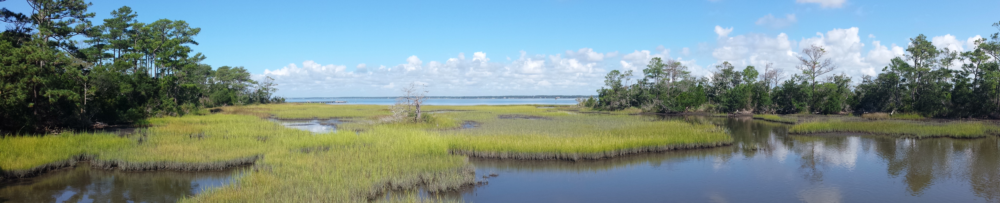

  

# Kevin Purcell {#top}
*Marine Ecology, Fisheries, Molecular Ecology, Evolutionary Ecology*  

***
###### 

## About Me

I am [Kevin Purcell](http://impactstory.org/KevinPurcell) currently a postdoctoral researcher working with [J. Kevin Craig](http://www.sefsc.noaa.gov/labs/beaufort/staff/kevincraig.htm) at the [NOAA Southeast Fishery Science Center](http://www.sefsc.noaa.gov/labs/beaufort/) and [Duke Marine Lab](http://nicholas.duke.edu/marinelab) in [Beaufort](http://www.beaufortnc.org/), NC. My research focuses on the ecological and evolutionary mechanisms by which populations deal with environmental disturbance.  Currently, I am collaborating on several projects aimed at examining the effects of coastal eutrophication and hypoxia on the economic and ecological dynamics of fisheries and nekton communities in the Northern Gulf of Mexico.  On this page you can find information about my [research](#research), [publications](#publications), [grants](#grants), [teaching experience](#teaching) and [presentations](#presentations).  My PDF version of my curriculum vitae is available [here](http://kevin-purcell.com/purcell_cv.pdf).

### Contact
Email:  <web@kevin-purcell.com>  
Address: NOAA Fisheries, SEFSC, Beaufort Lab, 101 Pivers Island Rd. Beaufort, NC 28516-9722.  
Phone: 252-728-8761  
Orcid ID: [0000-0001-6046-2774](http://orcid.org/0000-0001-6046-2774)  
twitter: [@kevin_purcell](https://twitter.com/kevin_purcell)  
GitHub: [kpurcell](https://github.com/kpurcell)  

***

## Employment {#employment}
* 2011-, Postdoctoral Associate, [Duke University](http://duke.edu/), [Nicholas School of the Environment](http://nicholas.duke.edu/) and the [National Marine Fishery Service](http://www.nmfs.noaa.gov/), [Beaufort Lab](http://www.sefsc.noaa.gov/labs/beaufort/).  
* 2009-2011, Postdoctoral Fellow, [North Dakota State Univesity](http://www.ndsu.edu/),[Environmental and Conservation Sciences](http://www.ndsu.edu/ecs/).  
* 2008-2009, Research Assistant, [University of Louisiana-Lafayette](http://www.louisiana.edu/), [Neigle Lab](http://seahorse.louisiana.edu/)  
* 2006-2008, Instructor, [University of Louisiana-Lafayette](http://www.louisiana.edu/), [Biology Department](http://biology.ucs.louisiana.edu/)  
* 2003-2006, University Fellow, [University of Louisiana-Lafayette](http://www.louisiana.edu/), [Biology Department](http://biology.ucs.louisiana.edu/)  

***

## Education {#education}
* Ph.D.  [University of Louisiana-Lafayette](http://www.louisiana.edu/), [Biology Department](http://biology.ucs.louisiana.edu/)  
(Environmental and Evolutionary Biology, 2009)  
* M.S. [Bloomsburg University](bloomu.edu), [Biological Sciences](http://departments.bloomu.edu/biology/)  
(Biology, 2002)  
* B.S. [East Stroudsburg University](esu.edu), [Biological Sciences](http://www4.esu.edu/academics/departments/biology/index.cfm)  
(Biology, 1999 and Marine Science, 1999)  

***

## Publications {#publications}

### Peer-reviewed
* **K. M. Purcell**, C. A. Stockwell.  2013. Provenance and Peregrination: an evaluation of the genetic structure and post-introduction dispersal of a non-native invasive fish to the North Island, New Zealand.  Biological Invasions. (*In review*)  

* D. Enfield, G. Goni, F. Bringas, D. Lindo, S.-Ki Lee, Y. Liu, B. Muhling, L. Avens, J. Agar, J. Litz, P. Richards, L. Garrison, **K. M. Purcell**, J. Smith, N. Bartlein, T. Minello, B. McAnally, D. Apeti, H. Perryman.  (editors) M. Kamauskas, M. J. Schirripa, C. Kelble, G. Cook, J. K. Craig. 2013.  Gulf of Mexico Ecosystem Status Report.  NOAA Technical Memorandum #NMFS-SEFSC-653.[(pdf)](http://www.gulfcouncil.org/docs/Gulf%20of%20Mexico%20Ecosystem%20Status%20Report.pdf)  

* C. A. Stockwell, J. S. Heilveil, **K. M. Purcell**. 2012. Estimating divergence time for two evolutionarily significant units of a protected fish species. Conservation Genetics 14:215-222. [doi:](http://link.springer.com/article/10.1007/s10592-013-0447-1)10.1007/s10592-013-0447-1  

* **K. M. Purcell**, P. L. Klerks, A. T. Hitch, P. L. Leberg. 2012. The role of genetic structure in the adaptive divergence of populations experiencing saltwater intrusion due to relative sea-level rise.  J. Evolutionary Biology 25:2623-2632. [doi:](http://onlinelibrary.wiley.com/doi/10.1111/jeb.12016/abstract;jsessionid=7EAE5BE1A2B6811796234393BDB7D8A3.f01t01?deniedAccessCustomisedMessage=&userIsAuthenticated=false)10.1111/jeb.12016  

* **K. M. Purcell**, N. Ling, C. A. Stockwell. 2012. Evaluation of the introduction history and genetic diversity of a serially introduced fish population in New Zealand.  Biological Invasions 14:2057-2065. [doi:](http://link.springer.com/article/10.1007/s10530-012-0213-1)10.1007/s10530-012-0213-1  

* C. A. Stockwell, **K. M. Purcell**, M. L. Collyer, J. Janovy. 2011. Effects of Salinity on *Physa acuta*, the Intermediate Host for the Parasite Posthodiplostomum minimum: Implications for the Translocation of the Protected White Sands Pupfish. Transactions of the American Fisheries Society 140:1370-1374. [doi:](http://www.tandfonline.com/doi/full/10.1080/00028487.2011.620499#.Uuf-HvhOn_g)10.1080/00028487.2011.620499  

* **K. M. Purcell**, S. L. Lance, K. L. Jones, C.A. Stockwell. 2011. Ten novel microsatellite markers for the western Mosquitofish, *Gambusia affinis*.  Conservation Genetic Resources 3: 361-363. [doi:](http://link.springer.com/article/10.1007/s12686-010-9362-7)10.1007/s12686-010-9362-7  

* A. T. Hitch, S. B. Martin, **K. M. Purcell**, P. L. Klerks, P. L. Leberg.  2010. Interactions of salinity, marsh fragmentation and submerged aquatic vegetation on resident nekton assemblages of coastal marsh ponds.  Estuaries and Coasts 34: 653-662. [doi:](http://link.springer.com/article/10.1007/s12237-010-9367-1)10.1007/s12237-010-9367-1  

* **K. M. Purcell**, P. L. Klerks, P. L. Leberg.  2010.  Adaptation to sea level rise: Does local adaptation influence the demography of coastal fish populations.  Journal of Fish Biology 77:1209-1218. [doi:](http://onlinelibrary.wiley.com/doi/10.1111/j.1095-8649.2010.02727.x/abstract?deniedAccessCustomisedMessage=&userIsAuthenticated=false)10.1111/j.1095-8649.2010.02727.x  

* S. B. Martin, A. T. Hitch, **K. M. Purcell**, P. L. Klerks, P. L. Leberg.  2009.  Life history variation along a salinity gradient in coastal marshes.  Aquatic Biology 8:15-28. [doi:](http://www.int-res.com/abstracts/ab/v8/n1/p15-28/)10.3354/ab00203  

* **K. M. Purcell**, A. T. Hitch, P. L. Klerks, P. L. Leberg.  2008.  Adaptation as a potential response to sea-level rise: a genetic basis for salinity tolerance in populations of a coastal marsh fish.  Evolutionary Applications 1: 155–160. [doi:](http://onlinelibrary.wiley.com/doi/10.1111/j.1752-4571.2007.00001.x/full)10.1111/j.1752-4571.2007.00001.x [(pdf)](http://onlinelibrary.wiley.com/doi/10.1111/j.1752-4571.2007.00001.x/pdf)  

* P. L. Leberg, M. C. Green, B. A. Adams, **K. M. Purcell**, M. C. Luent.  2007.  Response of waterbird colonies in southern Louisiana to recent drought and hurricanes.  Animal Conservation 10: 502–508. [doi:](http://onlinelibrary.wiley.com/doi/10.1111/j.1469-1795.2007.00141.x/abstract?deniedAccessCustomisedMessage=&userIsAuthenticated=false)10.1111/j.1469-1795.2007.00141.x  

### In development
* **K. M. Purcell**, J. Nance, M. Smith, J. K. Craig. 2013. Coastal hypoxia and its effects on the spatial dynamics of a large marine fishery. (44 pgs, 5 fig, 2 table)  

* **K. M. Purcell** and J. K. Craig. 2013. Global fishery imports and Eutrophication: synergistic effects on
community dynamics. (27 pgs, 5 figs, 2 tables)  

###### [top](#top)
***

### Grants {#grants}
* **K. M. Purcell**, J.K. Craig, K. Andrews, J. Nance, E. Scott-Denton. 2014. A spatial analysis of bycatch estimation methodologies for the Gulf of Mexico shrimp fishery. *Information to Support and Conduct Stock Assessments Program*. (**$97,000**) (*In review*)  

* **K.M. Purcell** J.K. Craig. J.W. Smith.  2014.  Unmanned Aircraft Systems (UAS) as a tool for fishery-independent data collection in support of fisheries management.  *NOAA Fisheries Advanced Sampling Technology Working Group*. (**$122,000**) (*In Review*)  

* **K. M. Purcell**, J.K. Craig, K. Andrews, J. Nance, E. Scott-Denton, J. Primrose. 2014. Spatial dynamics of bycatch in the Gulf of Mexico shrimp fishery. *Marine Fisheries Initiative* (MARFIN). (**$95,000**) (*In review*)  

* S. T. Walter, J. Karubian, **K. M. Purcell**, J. K. Craig, P.L. Leberg. 2012. Effects of hypoxia on brown pelican foraging ecology and demographic processes. _National Geographic_. (**$20,000**)  

* J. D. Fisher, **K. M. Purcell**, C. A. Stockwell. 2009. A genetic evaluation of northern leopard frog populations in North Dakota. _North Dakota State Wildlife Grant Program_. (**$100,000**)

###### [top](#top)

***

## Presentations {#presentations}

### Publsihed Abstracts & Presentations

* **K. M. Purcell**, J. K. Craig, M. D. Smith, J. M. Nance.  2013. The effects of hypoxia on the spatial dynamics of the northwestern Gulf of Mexico.  Aquatic Sciences meeting of the American Society for Limnology and Oceanography. New Orleans, LA.  

* J. D. Fisher, **K. M. Purcell**, C. Stockwell.  2013.  Landscape influences on effective population size of Northern Leopard Frog in North Dakota.  50th North Dakota Chapter of the Wildlife Society.  Mandan, ND.

* **K. M. Purcell** and C. Stockwell.  2012.  Evaluation of the introduction history and genetic diversity of a serially introduced fish population in New Zealand.  1st North America Congress for Conservation Biology.  Oakland, CA.  

* J. Fisher, **K. M. Purcell**, C. Stockwell. 2012.  Genetic Diversity of the Northern Leopard frog across the 100th meridian.  1st North America Congress for Conservation Biology, Oakland, CA. (poster)

* C. Stockwell, J. Heilveil, **K. M. Purcell**.  2012.  Estimating time of divergence for two evolutionary significant units of a protected fish species.  1st North American Congress for Conservation Biology.  Oakland, CA.  

* **K. M. Purcell** and J. K. Craig.  2012.  The Impact of Hypoxia and Spatial Distribution on Catchability in the Gulf of Mexico Shrimp Fishery.  26th Annual Meeting of the American Fisheries Society, Tidewater Chapter, Beaufort, NC.

* **K. M. Purcell**, N. Ling, C. Stockwell.  2011.  Evaluation of the introduction history and genetic diversity of serially introduced mosquitofish populations in New Zealand.  25th International Congress for Conservation Biology.  Auckland, NZ.

* **K. M. Purcell** and C. A. Stockwell.  2011.  Provenance and diversity of a serially introduced fish population in New Zealand.  Joint Meeting of Icthyologists and Herpetologists, Minneapolis, MN.  

* **K. M. Purcell** and P. L. Leberg.  2010.  The impact of sea level rise and phenotypic divergence on the genetic structure of a coastal marsh fish.  Evolution, Portland, OR.  

* **K. M. Purcell** and P. L. Leberg.  2008.  Adaptation to salinity stress: the role of genetic architecture and geographical separation.  Ecological Society of America’s 93rd Annual International Meeting.  Milwaukee, WI.  

* **K. M. Purcell** and P. L. Leberg.  2008.  Spatial Differences in genetic adaptation to saltwater intrusion.  Coastal Restoration and Enhancement through Science and Technology’s Annual Award Symposium.  New Orleans, LA.

* **K. M. Purcell** and P.L. Leberg.  2005.  Effects of historical salinity exposure on coastal mars fish populations.  Estuarine Research Federation’s 18th Biennial International Conference.  Norfolk, VA. 

* **K. M. Purcell** and PL Leberg.  2004.  Salinity Resistance in coastal marsh fish populations.  Gulf Estuarine Research Society. Pensacola, FL.  

### Invited Seminars

* **K. M. Purcell**, M. Smith, L. Bennear, J. Nance, , J. K. Craig.  2013.  Non-linear modeling of coastal hypoxia and its impacts on the Gulf of Mexico shrimp fishery.  Forum for Gulf of Mexico Hypoxia Research Coordination and Advancement, Mississippi State University, Stennis Space Center, MS.  

* **K. M. Purcell**, J. Nance, J. K. Craig.  2012.  Ecological and economic effects of hypoxia on the gulf shrimp fishery.  3rd Annual Hypoxia Coordination Workshop, Bay St. Louis, MS.

* **K. M. Purcell**.  2011.  The eco-evolutionary dynamics of salinity stress on a coastal nekton population.  National Oceanic and Atmospheric Association, Beaufort, NC. 

* **K. M. Purcell**, P. L. Leberg.  2010.  Adaptation to salinity stress; the response of coastal fish populations to a changing world.  Department of Biology, Rivier College, Nashua, NH.

* **K. M. Purcell**.  2009.  Implications of changing climate and sea level rise on coastal communities.  4th Annual Global Climate Teach-In, Fargo, ND.

* **K. M. Purcell**.  2008.  The genetics of adaptation to sea level rise: evolution in coastal marsh fish populations.  Environmental Research Laboratory, US Army Corp of Engineers, Vicksburg, MD.

###### [top](#top)

***

## Research {#research}

My research program investigates how populations respond to changing environments.  I am particularly interested in the ecological and evolutionary mechanisms by which populations respond to anthropogenic disturbance over ecological time scales.  The mechanisms by which populations respond to changes in the environment can have dramatic consequences on their ecology and evolution.  Understanding these causal mechanisms provides valuable insights for the applied disciplines of conservation biology and resource management while advancing theoretical aspects of the ecological and evolutionary sciences.  I utilized a combination of experimental, molecular and statistical modeling approaches to address three broad questions: 

1. To what extent does the spatial and genetic structure of populations influence the effects of environmental stochasticity on population dynamics?  
2. What are the relative contributions of adaptation, plasticity and dispersal on the response of populations to biotic and abiotic stress?  
3. How do environmental and anthropogenic stochasticity interact with density-dependence to dictate the dynamics and distribution of populations and control the diversity and structure of communities?  

### Current Projects
Currently, I am involved in a collaboration between Duke University and NOAA Fisheries funded by the [Gulf of Mexico Ecosystem & Hypoxia Assessment (NGOMEX) Program](http://www.cop.noaa.gov/stressors/pollution/current/gomex-factsheet.aspx) through the [Center for Sponored Coastal Oceans Research (CSCOR)](http://www.cop.noaa.gov/).  I am examining the ecological and economic impact of multiple stressors (eutrophication, commercial fishing, and habitat degradation) on both commercial fishery populations and nektonic marine communities.  This project is largely computational using eco-informatics approaches to synthesize data from both fishery-dependent and fishery-independent sources.  

### Past Projects
A number of my previous research projects have sought to address these questions using the structurally complex and highly variable environment of coastal and marine ecosystems.  For example, my dissertation research focused on the implications of sea-level rise and fragmentation on the coastal estuaries of the northern Gulf of Mexico.  I used a quantitative genetics framework to show that in a period of less than 50 years there was observable phenotypic divergence between populations exposed to differing levels of salinity and that the mechanisms driving these phenotypic differences were genetic in nature [(*Evolutionary Applications 1 (1) 155–160*)](http://onlinelibrary.wiley.com/doi/10.1111/j.1752-4571.2007.00001.x/full).  I employed an experimental common garden approach to evaluate the role of genetic adaptation on the demography of populations in disturbed coastal systems [(*Journal of Fish Biology 77(6) 1209-1218*)](http://onlinelibrary.wiley.com/doi/10.1111/j.1095-8649.2010.02727.x/abstract?deniedAccessCustomisedMessage=&userIsAuthenticated=false).  To understand the interplay of fragmentation, salinity stress and changes in population dynamics, I conducted a microsatellite survey to characterize the neutral diversity and the genetic structure of populations across a selective gradient [(*Journal of Evolutionary Biology 25(11) 2623-2632*)](http://onlinelibrary.wiley.com/doi/10.1111/jeb.12016/abstract;jsessionid=7EAE5BE1A2B6811796234393BDB7D8A3.f01t01?deniedAccessCustomisedMessage=&userIsAuthenticated=false).  Additionally, I have used an invasive biology framework to further examine the central question of how populations respond to changing environments.  Specifically, I have developed a set of molecular markers [(*Conservation Genetic Resources 3(2) 361-363*)](http://link.springer.com/article/10.1007/s12686-010-9362-7) for a highly invasive estuarine fish species to investigate the introduction history and evaluate the impact of serial introductions on the genetic diversity of these populations [(*Biological Invasions 14(10) 2057-2065*)](http://link.springer.com/article/10.1007/s10530-012-0213-1).  

###### [top](#top)

***

## Teaching {#teaching}

### Philosophy
Teaching the sciences involves not only educating students in the fundamental topics and principles of the biological sciences, but also providing them with the intellectual tools that will allow them to develop into scientifically literate thinkers.  To this end, my teaching objectives are:  

1. to provide students with the subject mastery needed to proceed and excel with their course of study  
2. to cultivate strong critical thinking and reasoning skills which can be applied across disciplines  
3. to stimulate interest in the sciences and create scientifically literate students with the confidence to communicate that knowledge to others.  

To achieve my teaching objectives I develop learner-centered curricula using Bloom's taxonomy schema and a backward course design approach.  I am very interested in the interface between quantiative analysis and science pedagogy.  

### Experience

I have designed and taught a number of classes over the last several years.  

* **Introduction to Biology** (4 credit; 100/200 Level)  
* **Conservation Biology** (3 credit; 400/600 Level)  
* **Marine Invertebrates Lab** (1 credit; 400 level)  
* **Introduction to Biology Lab** (1 credit; 100/200 Level)  

###### [top](#top)

***
 This work is licensed under a <a rel="license" href="http://creativecommons.org/licenses/by/4.0/deed.en_US">Creative Commons Attribution 4.0 International License</a>.

######  *updated 14 May 2014*  

